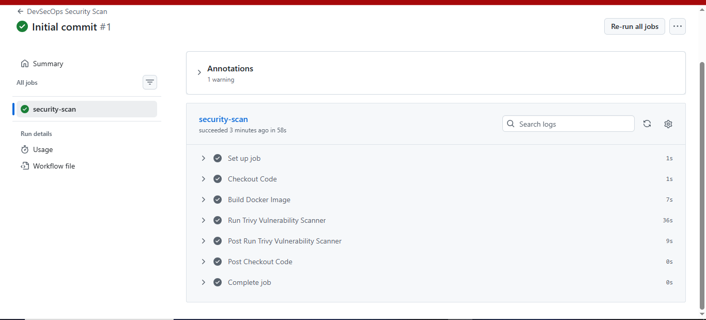

# DevSecOps Project

## Overview

This project demonstrates DevSecOps practices by integrating security scanning into a CI/CD pipeline using GitHub Actions and Trivy.

The pipeline automatically builds a Docker image and performs vulnerability scanning to identify security risks before deployment.

---

## Technologies Used

* Docker
* GitHub Actions
* Trivy
* Nginx
* Git
* GitHub

---

## Project Structure

devsecops-project/

├── app/

│   ├── index.html

│   └── Dockerfile

├── .github/

│   └── workflows/

│       └── security-scan.yml

├── screenshots/

├── docs/

└── README.md

---

## Security Pipeline

1. Push code to GitHub.
2. Build Docker image.
3. Run Trivy vulnerability scan.
4. Generate security findings.
5. Report vulnerabilities.

---

## Features

## Features

- Automated Security Scanning
- Docker Image Vulnerability Analysis
- Trivy Integration
- GitHub Actions Security Pipeline
- CI/CD Security Automation
- Container Security Validation
- DevSecOps Best Practices

---

## Workflow Result

The GitHub Actions workflow successfully completed the following stages:

- Checkout Source Code
- Build Docker Image
- Run Trivy Vulnerability Scanner
- Generate Security Findings

### Pipeline Screenshot

---

## Learning Outcomes

* DevSecOps Fundamentals
* Container Security
* Vulnerability Management
* Trivy Scanner
* Secure CI/CD Pipelines
* GitHub Actions Security Automation

---

## Future Improvements

* Docker Hub Integration
* Kubernetes Security Scanning
* Secrets Detection
* Security Gates
* Policy Enforcement

